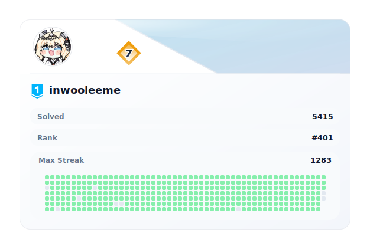

  

### Experience

### 👥 알고리즘 대회 참가 이력

<ul>
  <li>2022 UCPC 예선 참가 240th</li>
  <li>2024 UCPC 예선 참가 132th</li>
  <li>2025 UCPC 예선 참가 135th</li>
</ul>

### 🏆️ Awards (3)

<ul>
  <li>2024년 전남대학교 소프트웨어중심대학 제7회 SW프로그래밍 경진대회(호남•제주권) - 장려상</li>
   
  <li>2024년 ICPC 전북대학교 예선 경시대회 - 금상</li>
   
  <li>2025년 ICPC 전북대학교 예선 경시대회 - 교내 2위</li>
   
  <li>2025년 ICPC 예선 전체 128등</li>
</ul>

### 🚀 알고리즘 대회 출제 및 운영 (3)

<ul>
  <li>2024년 전북대학교 알고리즘 경진대회 출제 및 운영 - (A번 : 강아지 산책, E번 : 문자열을 다루는 문제가 문제다)</li>
   
  <li>2025년 전북대학교 알고리즘 경진대회 출제 및 운영 - (F번 : 성범이의 검증 시험에 답하라!)</li>
   
  <li>2026년 전북대학교 알고리즘 경진대회 출제 및 운영</li>
</ul>

### 🎓 Certificate (3)

<ul>
  <li>
    <strong>📊 데이터분석 준전문가 (ADsP, Advanced Data Analytics Semi-Professional)</strong>
      <small>한국데이터산업진흥원 (K-DATA, Korea Data Agency) · 2026.03.06</small>
  </li>
   
  <li>
    <strong>📜 한국사능력검정시험 1급</strong>
      <small>국사 편찬 위원회 (National Institute of Korean History) · 2025.10.31</small>
  </li>
   
  <li>
    <strong>📁 정보처리기사</strong>
      <small>한국산업인력공단 · 2025.12.24</small>
  </li>
</ul>
